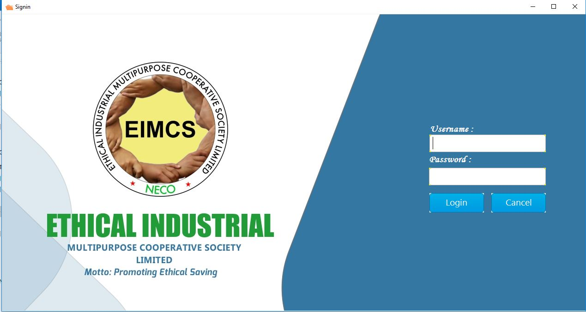
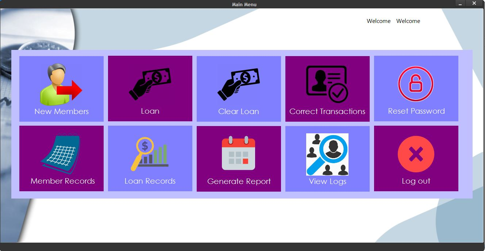
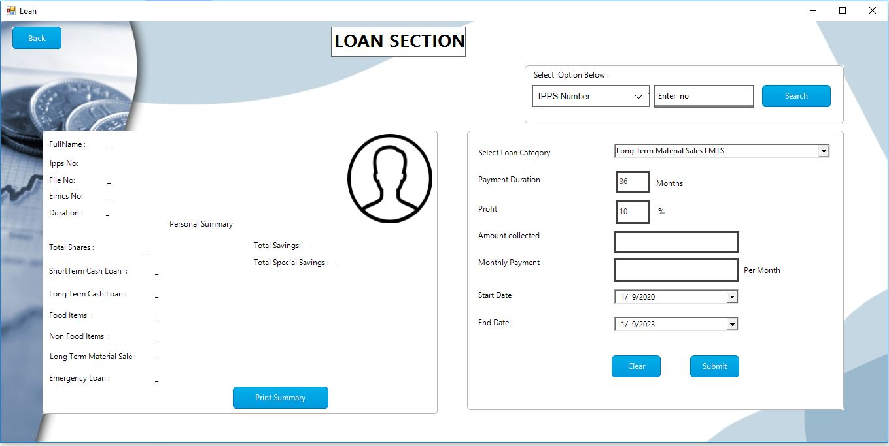
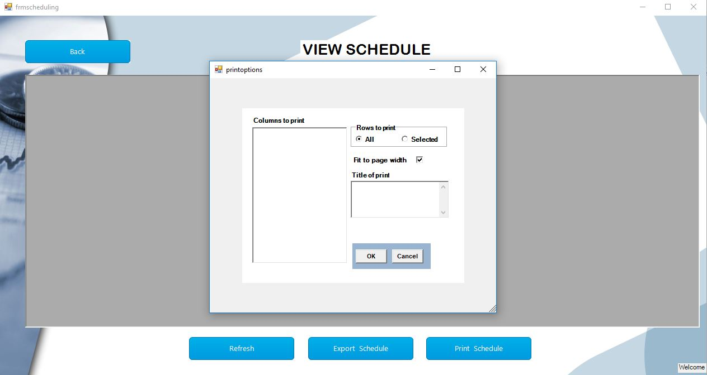
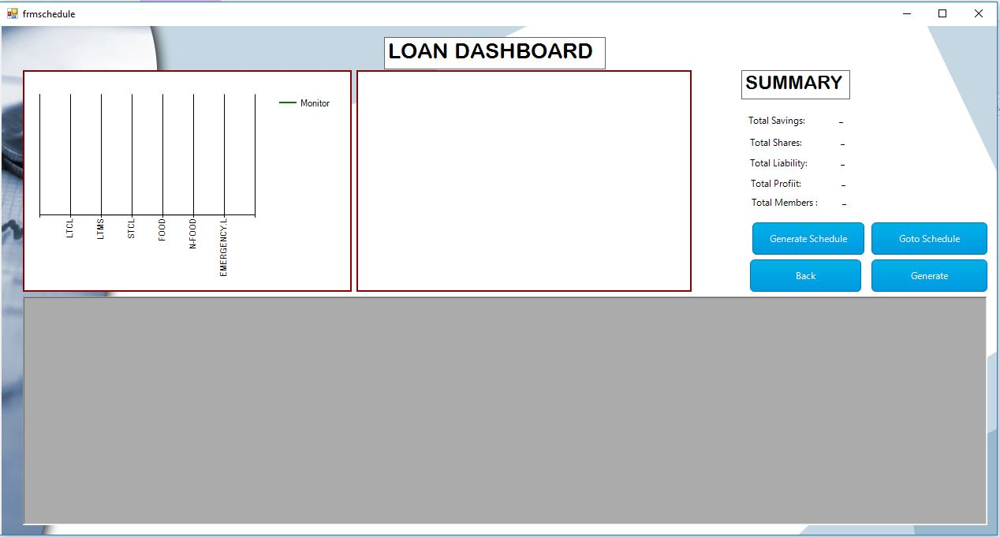

# LOAN MANAGMENT SYSTEM

The software is a Loan Managment system.The Loan Management System (LMS) is an innovative, turn-key, end-to-end securities-based lending platform that connects lenders seeking high-quality, collateralized loans with borrowers requiring convenient access to credit.
 This software was developed using Micrioft VB.net and MySQL.
 
 link to executable files :
 Link 1 : https://github.com/Ejigsonpeter/eimcsupdate/blob/personal/Eimcs/Debug/setup.exe
 Link 2 : https://github.com/Ejigsonpeter/eimcsupdate/blob/personal/Eimcs/Debug/Eimcs.msi

Below is the login Screen

User Dashboard

Add new Users
![Login Screen](3.JPG

Loan Section

Loan payment section

user Record

Developed by Ejigapeter :
contact me @ +2348136777456 or ejigsonpeter@gmail.com
